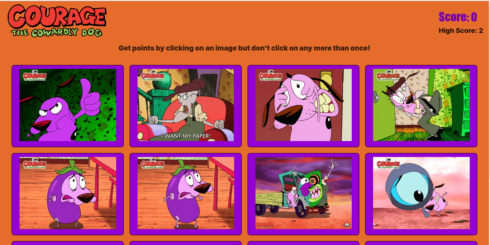

# Memory Game

This is a project assignment from [The Odin Project](https://www.theodinproject.com). The aim of the project is to understand the basics of React UseEffect.

### [Live demo] (https://memory-game-five-wine.vercel.app)

## Project Description

Memory is a game testing the memory of the player. The player gets points by clicking on an image but if the player clicks one image twice the game resets. Score updates every time the player clicks an image.

Use the package manager Npm to start project.

```bash
npm run dev
```

## Screenshot


